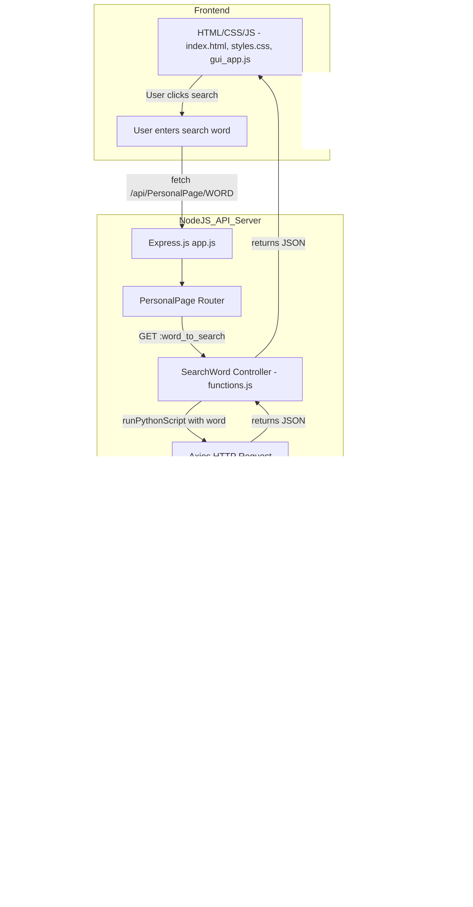
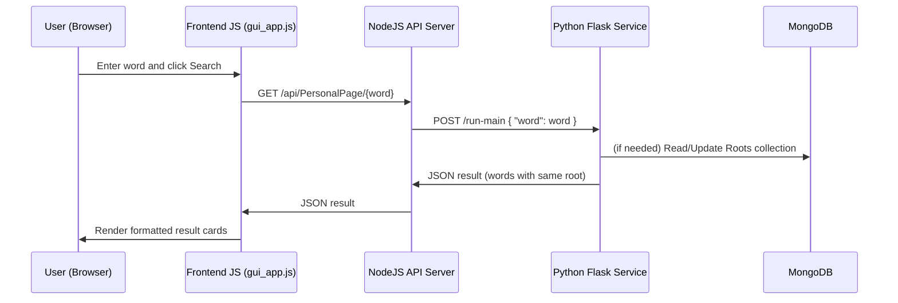

# LemmaFind

```mermaid
flowchart TD
    subgraph Frontend
        A1[HTML/CSS/JS - index.html, styles.css, gui_app.js]
        A2[User enters search word]
    end

    subgraph NodeJS_API_Server
        B1[Express.js app.js]
        B2[PersonalPage Router]
        B3[SearchWord Controller - functions.js]
        B4[Axios HTTP Request]
    end

    subgraph Python_Service
        C1[Flask App - main.py]
        C2[main_logic]
        C3[heb_pipe_dicta.process_roots_memory]
        C4[MongoDB: Roots Collection]
        C5[find_values.get_values_from_dict_inMongo]
    end

    subgraph Database
        D1[(MongoDB)]
    end

    A1 -->|User clicks search| A2
    A2 -->|fetch /api/PersonalPage/WORD| B1
    B1 --> B2
    B2 -->|GET :word_to_search| B3
    B3 -->|runPythonScript with word| B4
    B4 -->|POST /run-main with word| C1
    C1 -->|call main_logic| C2
    C2 -->|if PROCESS: process file| C3
    C2 -->|find values| C5
    C3 -->|update| C4
    C5 -->|read| C4
    C4 <--> D1
    C1 -->|returns JSON| B4
    B4 -->|returns JSON| B3
    B3 -->|returns JSON| A1

```

```mermaid
sequenceDiagram
    participant User as User (Browser)
    participant FE as Frontend JS (gui_app.js)
    participant API as NodeJS API Server
    participant PY as Python Flask Service
    participant DB as MongoDB

    User->>FE: Enter word and click Search
    FE->>API: GET /api/PersonalPage/{word}
    API->>PY: POST /run-main { "word": word }
    PY->>DB: (if needed) Read/Update Roots collection
    PY->>API: JSON result (words with same root)
    API->>FE: JSON result
    FE->>User: Render formatted result cards
```
